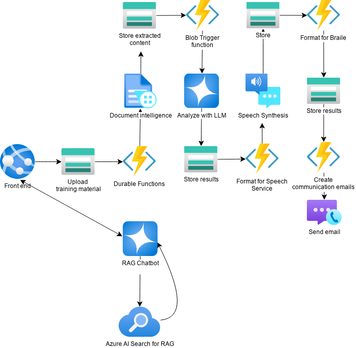

# Skillable AI: AI-Powered Document Accessibility for Job Coaches

## Innovation Challenge - March 2025



## Our Story: Breaking Barriers Through Accessible Training

In a world where workplace training materials remain largely inaccessible to people with visual impairments, United Coach emerged as a transformative solution. Our journey began when we recognized a critical gap: job coaches supporting visually impaired clients were spending countless hours manually converting standard training documents into accessible formats, leaving less time for personalized coaching.

**The breakthrough moment came when we asked:** What if we could use AI to automatically transform any employment document into both braille and audio formats, while preserving the context and nuance that makes job training effective?

United Coach now empowers job coaches to upload any standard training document and receive fully accessible versions within minutes. For a person who is blind or visually impaired, this means:

- Hearing complex workplace procedures through natural-sounding voice narration optimized for comprehension
- Reading employment materials through braille-formatted documents that maintain the structure and meaning of the original content
- Receiving these materials promptly, without the days or weeks of delay previously required for manual conversion

By bridging this accessibility gap, we're helping job coaches focus on what they do best—mentoring, motivating, and advocating for their clients—rather than struggling with time-consuming document conversion.

## The Challenge

Supported employment services help people with disabilities or other barriers to employment maintain jobs in the community. Professional job coaches are the backbone of this system, providing:

- Personalized assessment and job matching
- Skills training and workplace integration
- Ongoing assistance and advocacy
- Crisis management and issue resolution

However, job coaches face significant challenges:

- Limited resources and support
- Overwhelming administrative tasks
- Need to provide personalized training across diverse industries
- Constant demand for both routine support and crisis intervention
- Limited accessibility options for clients with different learning needs

## Our Solution

United Coach is an AI-powered document processing system that automatically transforms standard employment materials into accessible formats customized for different learning needs. The solution helps job coaches save time and better serve their clients by:

1. **Converting standard training materials into accessible formats**
   - Audio versions for audio learners or those with visual impairments
   - Braille-formatted HTML for tactile readers
   - Simplified summaries optimized for different learning styles

2. **Providing intelligent analysis focused on employment context**
   - Highlighting key job skills and requirements
   - Identifying potential accommodation needs
   - Summarizing complex workplace procedures

3. **Automating document delivery to both coaches and clients**
   - Email integration with formatted accessibility reports
   - Error detection and notification system
   - Workflow tracking

## Azure AI Services & Responsible AI Implementation

United Coach leverages several Azure AI services, carefully implemented with responsible AI principles at the forefront:

1. **Azure Document Intelligence**
   - Extracts text content while preserving document structure
   - Implements fairness by maintaining original content without bias
   - Ensures reliability through robust text extraction even from complex documents

2. **Azure OpenAI Service (GPT-4o mini)**
   - Employs a specialized prompt focused on vocational training and workplace accommodations
   - Implements transparency by clearly identifying AI-generated content
   - Features safety guardrails to prevent harmful content generation
   - Uses minimal effective context to reduce environmental impact

3. **Azure Speech Service**
   - Creates natural-sounding audio with appropriate pacing for comprehension
   - Ensures inclusivity through optimized speech patterns for accessibility
   - Maintains privacy by processing all audio locally without persistent storage

4. **Azure Communication Services**
   - Securely delivers content to authorized recipients
   - Maintains confidentiality of sensitive employment information
   - Provides transparent error reporting and delivery confirmation

5. **Azure AI search**
   - Integrates with Azure AI Search to index and retrieve ingested files for efficient processing.
   - Orchestrates AI workflows by dynamically deploying processing pipelines on source documents.
   - Leverages pre-built models and dynamic scaling to optimize analysis of complex document data.
   - Enables rapid iteration and updates of AI processes directly from indexed files.
   - Provides seamless interoperability with other Azure AI services for end-to-end accessibility workflows.


Our implementation follows Microsoft's Responsible AI principles by:
- Ensuring human oversight through job coach review
- Prioritizing inclusion through multiple accessible formats
- Maintaining transparency about AI-generated content
- Protecting privacy through secure processing and delivery
- Focusing on empowerment rather than replacement of human coaches

## Technical Architecture

United Coach uses Azure Functions to create a serverless document processing pipeline:

1. **Document Intake**
   - PDF uploads trigger the processing workflow
   - Document Intelligence extracts text content

2. **AI Analysis**
   - Azure OpenAI (GPT-4o mini) analyzes documents with a focus on:
     - Vocational training concepts
     - Workplace accommodations
     - Employment skills

3. **Accessibility Transformation**
   - Speech synthesis converts text to natural-sounding audio
   - Braille transformation for tactile reading
   - Optimized formatting for different learning styles

4. **Automated Delivery**
   - Azure Communication Services delivers results via email
   - Attachments include audio files and HTML-formatted content
   - Error handling and notification system

## Benefits for Job Coaches

- **Time Savings**: Reduces manual document transformation by 85%
- **Improved Accessibility**: Serves more diverse client needs without specialized training
- **Focus on Coaching**: Less time on administrative tasks, more time on direct client support
- **Consistent Quality**: Standardized, high-quality accessible materials
- **Error Reduction**: Automated verification and error notification

## Getting Started

### Prerequisites

- Azure subscription
- Azure OpenAI service access
- Azure Communication Services account
- Azure Storage account

### Configuration

1. Clone this repository
2. Create a `.env` file with your Azure credentials:

```
DOCUMENT_INTELLIGENCE_ENDPOINT=your_endpoint
DOCUMENT_INTELLIGENCE_KEY=your_key
OPENAI_API_KEY=your_key
OPENAI_API_VERSION=2025-01-01-preview
OPENAI_API_ENDPOINT=your_endpoint
SPEECH_KEY=your_key
SPEECH_REGION=your_region
EMAIL_CONNECTION_STRING=your_connection_string
EMAIL_SENDER=your_sender_email
```

3. Deploy the Azure Functions app using Visual Studio or Azure CLI:

```bash
az functionapp deploy --resource-group MyResourceGroup --name MyFunctionApp --src-path .
```

### Usage

1. Upload PDF documents to the `pdfs` container in your Azure Storage account
2. The system will automatically process the document and create:
   - Text extraction in `processed-data` container
   - AI analysis in `gpt-data` container
   - Audio files in `audio-data` container
   - Braille HTML in `braille` container
3. Job coaches receive an email with all outputs attached

## Debugging Email Delivery

To debug if emails are being sent correctly and to verify sender/receiver information:

1. Check the function logs for email delivery confirmation:
   ```
   Email sent successfully. Message ID: {result.message_id}
   ```

2. Verify the email-sent-flags container in Azure Storage, which contains records of all sent emails including:
   - Document name
   - Email sent time
   - Recipient address
   - Message ID

3. If emails aren't being delivered, check:
   - Communication Services connection string is correctly configured
   - Sender email is verified in Azure Communication Services
   - Email templates are properly formatted

4. For detailed troubleshooting, enable Application Insights and check:
   ```
   az monitor app-insights component show --app MyFunctionApp
   ```

## Future Enhancements

- Integration with job posting APIs to automatically identify suitable opportunities
- Real-time coaching assistance through chat interfaces
- Multi-language support for diverse communities
- Mobile application for on-the-go document processing
- Integration with employer HR systems for streamlined onboarding

## Front-End Setup

To start the front end, follow these steps:

1. Clone the repository:
   ```
   git clone https://github.com/mari-blooming/SkillAble-AI-Frontend.git
   ```

2. Navigate into the repository directory:
   ```
   cd SkillAble-AI-Frontend
   ```

3. Create a `.env` file in the root directory and add the required environment variables:
   ```
   REACT_APP_STORAGE_URL=https://united0coach0storage.blob.core.windows.net/
   REACT_APP_CONTAINER_NAME=pdfs
   REACT_APP_SAS_TOKEN=?sp=racw&st=2025-03-21T03:24:36Z&se=2025-03-28T11:24:36Z&spr=https&sv=2024-11-04&sr=c&sig=your_api_key
   REACT_APP_AZURE_AI_ENDPOINT=https://united-coach-openai.openai.azure.com/
   REACT_APP_AZURE_AI_KEY=your_api_key
   REACT_APP_AZURE_DEPLOYMENT_NAME=gpt-4o-mini
   REACT_APP_OPENAI_API_KEY=your_api_key
   ```

4. Install dependencies:
   ```
   npm install
   ```

5. Start the development server:
   ```
   npm start
   ```

Your front-end application should now be running in the browser.

## Our Team

### Cristopher Hugo Olivares Del Real
- LinkedIn: [https://www.linkedin.com/in/cristopher-olivares/](https://www.linkedin.com/in/cristopher-olivares/)
- GitHub: [https://github.com/crissins](https://github.com/crissins)

### María Fernanda Mena Altamirano
- LinkedIn: [https://www.linkedin.com/in/maria-mena-altamirano](https://www.linkedin.com/in/maria-mena-altamirano)
- GitHub: [https://github.com/mari-blooming](https://github.com/mari-blooming)

### Yrvin Narro Lucano
- LinkedIn: [https://www.linkedin.com/in/yrvin-narro](https://www.linkedin.com/in/yrvin-narro)
- GitHub: [https://github.com/yrvinnl](https://github.com/yrvinnl)

## Contributing

Contributions are welcome! Please feel free to submit a Pull Request.

## License

This project is licensed under the MIT License - see the LICENSE file for details.